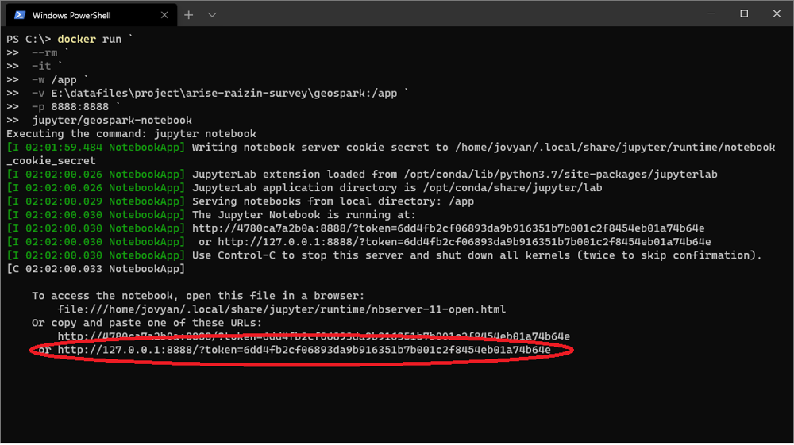

# geomesa code samples

### Ready geomesa environment using docker
https://github.com/locationtech/geomesa/releases  
* Download `geomesa-fs_2.11-2.4.0-bin.tar.gz` from the site above.
* Place it in `geomesa-sample\docker\geomesa-fs_2.11-2.4.0-bin.tar.gz`

```powershell
PS> cd C:\xxx\geomesa-sample\docker
PS> docker build `
        --build-arg GEOMESA_VER="2.4.0" `
        -t jupyter/geomesa-notebook -f Dockerfile `
        .\
```

### Run docker container
Set your working directory to the left of the -v option.

```powershell
PS> docker run `
        --rm `
        -it `
        -w /app `
        -v C:\<your working directory>:/app `
        -p 8888:8888 `
        jupyter/geomesa-notebook
```

### Access jupyter notebook
Access the URL with the token displayed after docker run. 


